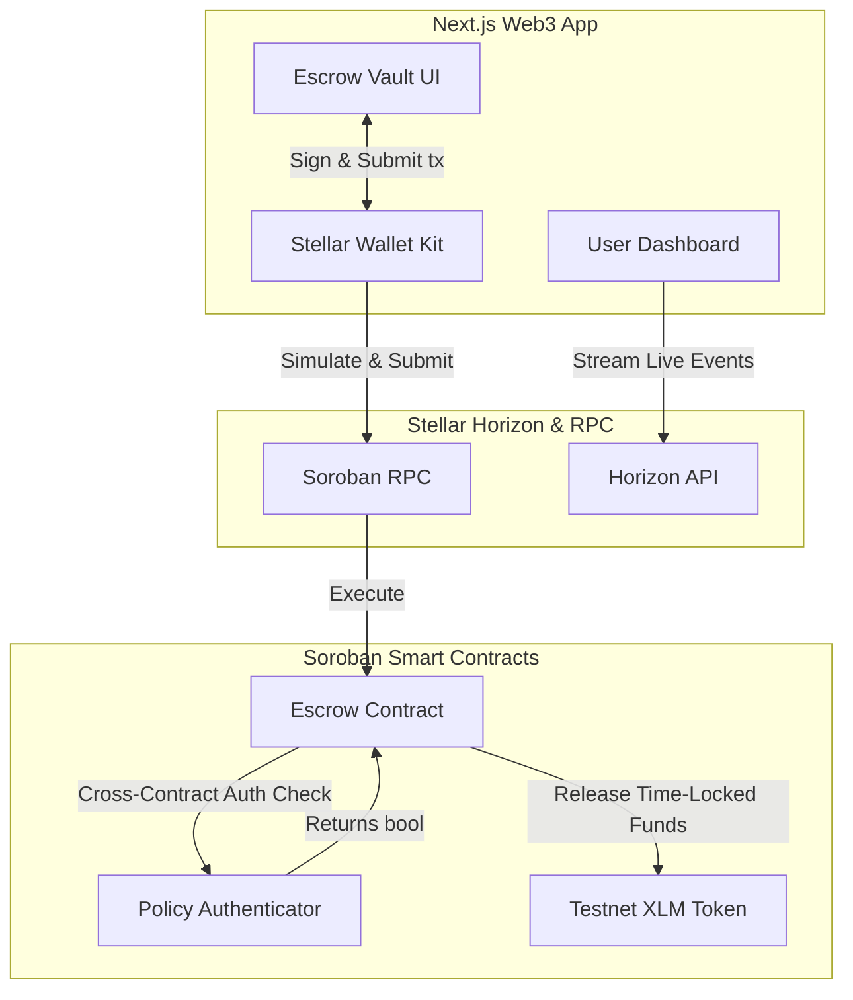

# Stellar Payment dApp - Levels 1, 2, and 3

A modern, decentralized application built on the Stellar Testnet. This dApp allows users to securely connect their Stellar wallets, view their XLM balance, send payments, and review their transaction history.

## Features

- **Wallet Connection**: Seamlessly connects to Stellar wallets using `@creit.tech/stellar-wallets-kit`. Supports Freighter, Albedo, xBull, and more.
- **Testnet Integration**: Fully integrated with the Stellar Testnet via `@stellar/stellar-sdk`.
- **Live Balances**: Fetches and displays native XLM balances directly from the Horizon network.
- **Transaction History**: Displays recent operations (Payments, Account Creation, Smart Contract Calls) complete with transferred amounts and Stellar Expert explorer links.
- **Dynamic UI**: Built with Next.js, Tailwind CSS, and shadcn/ui. Features a premium glassmorphism design, vibrant gradients, dark/light mode toggle, and a responsive interactive 3D starfield background powered by Three.js.

## Tech Stack

- **Frontend Framework**: Next.js 14 (App Router)
- **Styling**: Tailwind CSS & custom glassmorphism utilities
- **State Management**: Zustand
- **Web3 Integration**: 
  - `@stellar/stellar-sdk`
  - `@creit.tech/stellar-wallets-kit`
- **Animations & 3D**: Framer Motion, Three.js, React Three Fiber

## Getting Started

### Prerequisites

- Node.js v18+
- npm or yarn

### Installation

1. Clone the repository:
   ```bash
   git clone https://github.com/Be-bibek/demo-Dapp-web3.git
   cd demo-Dapp-web3/frontend
   ```

2. Install dependencies:
   ```bash
   npm install --legacy-peer-deps
   ```

3. Start the development server:
   ```bash
   npm run dev
   ```

4. Open [http://localhost:3000](http://localhost:3000) in your browser.

### Backend Smart Contracts Installation

1. Install Rust toolchain:
   ```bash
   rustup target add wasm32-unknown-unknown
   ```

2. Install Soroban CLI:
   ```bash
   cargo install --locked soroban-cli
   ```

3. Build contracts:
   ```bash
   cd backend
   cargo build --target wasm32-unknown-unknown --release
   ```

4. Run tests:
   ```bash
   cargo test
   ```

## Deployment Guide

### Smart Contracts Deployment (Soroban Testnet)
Deploying to the Stellar Testnet using the Soroban CLI:

1. Configure network:
   ```bash
   soroban network add --global testnet --rpc-url https://soroban-testnet.stellar.org:443 --network-passphrase "Test SDF Network ; September 2015"
   ```

2. Deploy Policy Contract:
   ```bash
   soroban contract deploy --wasm target/wasm32-unknown-unknown/release/policy.wasm --source <your-identity> --network testnet
   ```

3. Deploy Escrow Contract:
   ```bash
   soroban contract deploy --wasm target/wasm32-unknown-unknown/release/escrow.wasm --source <your-identity> --network testnet
   ```

### Frontend Deployment (Vercel/Netlify)
The frontend is a standard Next.js application, completely ready for Vercel:

1. Connect your GitHub repository to Vercel.
2. Ensure the Framework Preset is `Next.js`.
3. Set the Root Directory to `frontend`.
4. Click **Deploy**. Vercel will automatically build (`npm run build`) and host the application globally.

## Structure

- `frontend/app`: Next.js page routing and layout.
- `frontend/components`: Reusable UI components (Navbar, Backgrounds, etc.).
- `frontend/lib`: Core Stellar logic (`stellar.ts`) handling Horizon API calls.
- `frontend/store`: Zustand state management for wallet connections.

## Assessment - Level 1 Completed
- [x] Configure Freighter / Stellar Wallets Kit.
- [x] Connect to Stellar Testnet.
- [x] Fetch and display wallet balance.
- [x] Build simple payment interface.
- [x] Integrate Friendbot faucet for testnet funds.
- [x] Display robust transaction history.

## Assessment - Level 2 Completed (Smart Contract Integration)
- [x] **Smart Contracts**: Built and deployed two interdependent contracts on Soroban:
  - **[Time-Locked Escrow](https://stellar.expert/explorer/testnet/contract/CAISSVEWZWEGK66CWHUVV2YQHLSUXBHDZVGDIZ57BVXAP2D4T6QZAGKN)**: Locks XLM for a specified duration before withdrawal is permitted.
  - **[Policy Authenticator](https://stellar.expert/explorer/testnet/contract/CAKXYDS7OM2GH2JY5QUHA6EA4NGT6CPLTHGVHNGMEEIHLZAPSAYLD3M5)**: Acts as a middleware layer to verify if a user's address is authorized by the system administrator to withdraw funds.
- [x] **Error Handling**: Implemented 5 precise custom error classes in the frontend (`WalletNotInstalledError`, `UserRejectedError`, `TimeLockError`, `UnauthorizedPolicyError`, `InsufficientBalanceError`).
- [x] **Transaction Pipeline**: Full flow including building the XDR, Soroban transaction simulation, assembling with fees, signing via Wallet Kit, submission, and a robust status polling loop.
- [x] **Live Events (SSE)**: Set up Server-Sent Events listening to the Horizon API to provide a live, real-time feed of contract activity on the Vault page.
- [x] **UI/UX States**: The Vault page clearly manages and displays transaction states (Pending, Successful, Failed) with animated feedback and direct links to Stellar Expert.

## Assessment - Level 3 Completed (Production-Ready)
- [x] **CI/CD Pipelines**: Fully automated GitHub Actions workflows for both backend Rust smart contracts and frontend Next.js builds.
- [x] **Automated Testing**: Integrated Vitest and React Testing Library for frontend component validation alongside standard Cargo test suites for Soroban contracts.
- [x] **Documentation Complete**: Architecture Diagrams, Installation guides, and Deployment workflows precisely documented.
- [x] **Advanced Architecture**: Established cross-contract Soroban authentication.
- [x] **Real-Time Data**: Stable Horizon API polling implemented for live contract event tracking on user dashboard.

### Architecture Diagram

The frontend interacts with the Soroban smart contracts. When a withdrawal is requested, the Escrow contract makes a **cross-contract call** to the Policy Authenticator to ensure the user has been authorized before releasing the funds.


